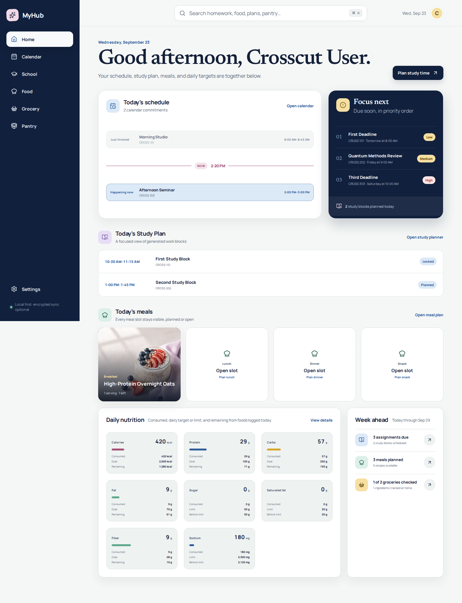
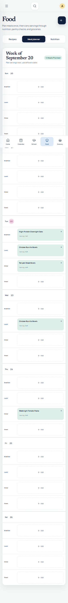
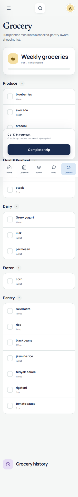

# MyHub

MyHub is a private, web-first college command center. It connects class schedules, homework, automatic study planning, recipes, meal planning, nutrition, pantry inventory, and grocery shopping in one locally persistent application.

The web application is the product-validation phase for a future native SwiftUI application for iPhone and iPad. It is a normal standalone React project that can be cloned, run, tested, modified, and deployed without Manus.

## What MyHub Does

**School planning** combines editable calendar events, multiple local iCalendar (`.ics`) sources, homework with subtasks and provenance, estimated work, preferred study hours, and configured avoid-time ranges. The deterministic planner works through each deadline and preserves blocks that the user locks, completes, moves, or resizes.

**Food planning** combines structured recipes and reviewable imports, cooking-friendly serving scaling and conversions, a weekly meal planner, prepared-versus-consumed servings, reusable leftovers, packaged foods, immutable food-log snapshots, and daily nutrition progress.

**Pantry and groceries** aggregate compatible recipe ingredients, compare those requirements with saved inventory, require an explicit Pantry Check decision for every requirement and added staple, generate a mobile-friendly editable shopping list, preserve completed trips as historical snapshots, and add only confirmed purchases back to the pantry.

## Project Status

Version **0.1.0** is a functional Phase 1 web prototype.

Working now:

- Responsive dashboard with connected school and food summaries
- Day, week, and month calendar views
- Full manual-event creation, editing, and deletion with source-aware display
- Previewed, confirmed multi-file `.ics` imports for Canvas, Google Calendar, and other exports
- RFC line unfolding, common timezone/all-day handling, rich event metadata, stable deduplication, and Canvas assignment mapping
- Full homework editing, progress/status, subtasks, source links, and imported provenance
- Deterministic conflict-aware study scheduling through deadlines, including configured avoid-time ranges
- Study-block locking, completion, removal, accessible form editing, direct week-column drag, and 15-minute resize buttons
- Structured recipe creation/editing, source metadata, notes, ingredient overrides, persistent current yield, and US/metric display conversion
- Reviewable recipe drafts from permitted URL JSON-LD, pasted content, local image OCR, or user-supplied social caption/screenshot/video frame
- Weekly meal planning for recipes, packaged foods, custom foods, and leftovers, with prepared, consumed, and leftover balances
- Packaged-food entry, read-only Open Food Facts lookup, local Nutrition Facts OCR with confirmation, and immutable six-metric nutrition snapshots
- Daily nutrition snapshots, editable targets, and totals that exclude planned meals until consumption is recorded
- Pantry inventory across pantry, refrigerator, and freezer
- Grocery aggregation across compatible mass, volume, and count units; explicit Pantry Check and staple review; editable shopping; confirmed-purchase pantry handoff; and immutable history
- Universal search across recipes, homework, and pantry items
- Empty first run, IndexedDB persistence, versioned migration, JSON export/import, and confirmed clear-all
- Optional encrypted GitHub Sync to a dedicated private data repository
- Light, dark, desktop, tablet, and mobile layouts
- GitHub Pages deployment workflow

In development or intentionally limited:

- Local `.ics` file import is the reliable browser path. Encrypted private-repository calendar snapshots can be checked after GitHub Sync is unlocked; no private feed URL or calendar file is bundled with MyHub.
- Recipe URL and Open Food Facts requests are direct browser requests and can fail because of CORS, network access, or incomplete public records. The interface preserves provenance, requires review for imported/OCR values, and offers pasted/manual entry fallbacks; CI uses mocked lookup/parser tests and does not require remote data.
- Image/video OCR runs locally in the browser after the user selects a file. Social intake accepts only user-supplied captions, screenshots, or local video frames; MyHub does not log in, scrape, or bypass platform restrictions.
- Study blocks can be dragged between week columns, but drag-and-drop is never required: the edit form and labeled keyboard-operable resize buttons remain available.
- GitHub Sync is snapshot-based rather than a transactional database; simultaneous edits require an explicit choice of copy.

Planned for native iOS and iPadOS after web review:

- A true SwiftUI interface using platform-native navigation
- EventKit calendar access
- Camera, Vision, VisionKit, PhotosPicker, and barcode scanning
- A Share Extension for legitimate intake from Safari, Photos, and supported apps
- A synchronization decision between CloudKit and a private shared backend

## Screenshots

### Desktop Dashboard



### Mobile Meal Planner



### Mobile Grocery Mode



## Technology Stack

MyHub uses **React 19**, **TypeScript**, **Vite**, semantic CSS, **IndexedDB**, **Vitest**, and **Playwright**. Hash routing keeps every application route usable on GitHub Pages without server rewrites. Feature routes are lazy-loaded to keep the initial bundle focused.

## Getting Started

Requirements:

- Node.js 22 or newer
- npm 10 or newer
- Git

```bash
git clone https://github.com/avicados14/MyHub.git
cd MyHub
npm install
npm run dev
```

Open the local address printed by Vite, normally `http://localhost:5173`.

## Building

```bash
npm run build
npm run preview
```

The optimized site is written to `dist/`. The GitHub Actions environment automatically sets the Vite base path to `/MyHub/` for repository-subpath hosting.[1]

## Testing

```bash
npm run lint
npm run typecheck
npm run test
npx playwright install chromium
npm run test:e2e
npm run build
```

Run the complete non-browser quality gate with:

```bash
npm run check
```

Domain tests cover recipe scaling, fraction formatting, safe unit normalization/conversion, meal consumption and leftovers, nutrition-label parsing, mocked Open Food Facts lookup/failure fallback, deterministic recipe imports, grocery aggregation and pantry decisions, long-horizon and avoid-time scheduling, ICS parsing/classification/deduplication, encrypted calendar snapshots, IndexedDB persistence, and backup validation. Focused browser tests cover food authoring/review/planning/consumption, pantry and grocery lifecycle, homework/subtasks/provenance, event CRUD, confirmed multi-file imports, study-block resizing, and responsive acceptance workflows.

## GitHub Pages Deployment

The workflow at `.github/workflows/pages.yml` runs on pushes to `main` and can also be started manually. It installs dependencies, runs linting, strict type checking, unit tests, the desktop Chromium browser project, and a production build. The locally validated Food V2 suite also covers tablet and mobile; extending that full matrix to CI remains a release-practice task. The workflow then uses the current GitHub Pages artifact workflow with least-privilege `pages: write` and `id-token: write` permissions.[2]

In the repository, choose **Settings → Pages → Build and deployment → GitHub Actions** if it is not already selected.

## Data Storage

Structured data is stored immediately in IndexedDB under the current browser profile and origin. A fresh installation starts with empty events, assignments, recipes, packaged foods, meals, leftovers, food logs, pantry, and grocery records. Version 1 local data and JSON backups migrate to the version 2 schema without dropping records.

Use **Settings → Data & privacy → Export data** to download a portable JSON backup. Import validates and migrates the MyHub backup envelope before replacing local data. **JSON exports are plaintext** and may contain private academic and food records.

## Optional GitHub Sync

GitHub Sync keeps IndexedDB as the offline working store and uploads only a versioned encrypted snapshot to the private `avicados14/MyHub-Data` repository at `myhub-data/v1/snapshot.enc` by default. It uses PBKDF2-SHA-256 with 310,000 iterations and AES-256-GCM. The encryption passphrase remains only in component/context memory.

When GitHub Sync is unlocked, Calendar can also consume an encrypted `myhub-data/v1/calendars.enc` snapshot through a narrow provider API. The calendar page never receives the token or passphrase: the provider fetches with the authenticated client and decrypts in memory. The page checks on open, offers an explicit refresh, and rechecks every 15 minutes while it remains open. A separate producer for that encrypted snapshot is not bundled with this static client.

Create a **fine-grained personal access token** limited to the single `MyHub-Data` repository with **Contents: read and write**. Do not use a classic PAT and do not grant workflow or administration permissions. The token is encrypted at rest in a separate IndexedDB credential record; it is never part of `AppData`, JSON backups, source code, logs, or remote plaintext.

The target repository must be private. Conditional writes use the current blob SHA, writes are serialized, and conflicts require choosing **Use this device** or **Use GitHub**. Deleting the latest remote snapshot cannot guarantee erasure from Git history, forks, caches, or GitHub retention.

## Clearing Data

Open **Settings → Data & privacy**, export anything you want to keep, and choose **Clear all data**. MyHub asks for explicit confirmation and restores empty personal collections while retaining reasonable non-personal defaults. The GitHub connection is not deleted; pause/unlink it separately, and use the explicit remote-delete control if needed.

## Repository Structure

```text
src/app/           Application shell, routes, and persistent state provider
src/components/    Reusable accessible UI primitives
src/domain/        Portable models and deterministic business logic
src/features/      Dashboard, calendar, school, food, pantry, grocery, settings
src/storage/       IndexedDB and backup boundary
src/styles/        Semantic tokens and responsive layouts
src/utilities/     Date, identity, and asset helpers
tests/             Playwright browser acceptance tests
public/recipes/    Original local recipe photography
.github/workflows/ Validation and GitHub Pages deployment
```

## Future iOS App

The future Apple application will reimplement the proven workflows using SwiftUI instead of wrapping this website in a WebView. The TypeScript domain models, invariants, calculation fixtures, and JSON backup format are the initial interoperability contract. See `MYHUB_IOS_PLAN.md`.

## Privacy

MyHub has no advertising, behavioral analytics, trackers, accounts, or marketing software. Core data and calculations stay in the browser unless the user enables optional client-side encrypted GitHub Sync. A user-initiated Canvas feed request goes directly from the browser to the provided URL; if the request is blocked, MyHub does not route it through another service.

Exported JSON backups can contain private academic and food records. Store them accordingly. Do not commit personal backup files or private feed URLs.

## Known Limitations

GitHub Pages is static hosting. MyHub therefore uses a user-supplied, repository-scoped fine-grained token instead of embedding a client secret. The browser necessarily holds the unlocked token and passphrase in memory while sync is active, so a compromised page/runtime can access them; unlinking clears the durable encrypted credential, not GitHub history. Some automatic imports still require a future backend or native adapter. IndexedDB can be cleared by browser or device storage management, so regular backups or encrypted sync are recommended.

## Roadmap

1. Validate and refine the complete web workflow.
2. Improve imports through explicit secure adapter boundaries.
3. Freeze approved data contracts and interaction behavior.
4. Build native iPhone and iPad interfaces in SwiftUI.
5. Add EventKit, camera, Vision, share-extension, and synchronization adapters only after the native foundation is approved.

## References

[1]: https://vite.dev/guide/static-deploy.html "Vite — Deploying a Static Site"
[2]: https://docs.github.com/en/pages/getting-started-with-github-pages/using-custom-workflows-with-github-pages "GitHub Docs — Using Custom Workflows with GitHub Pages"
